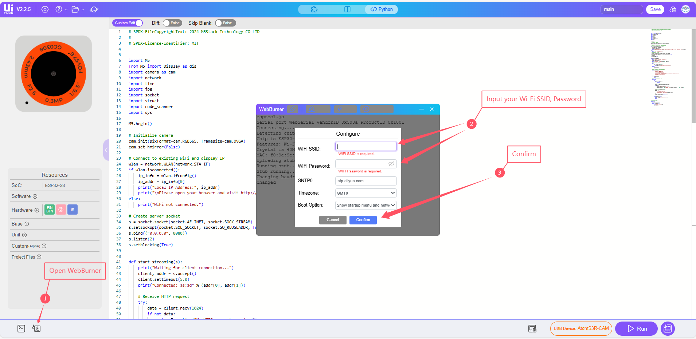
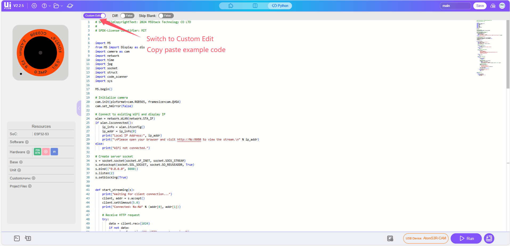
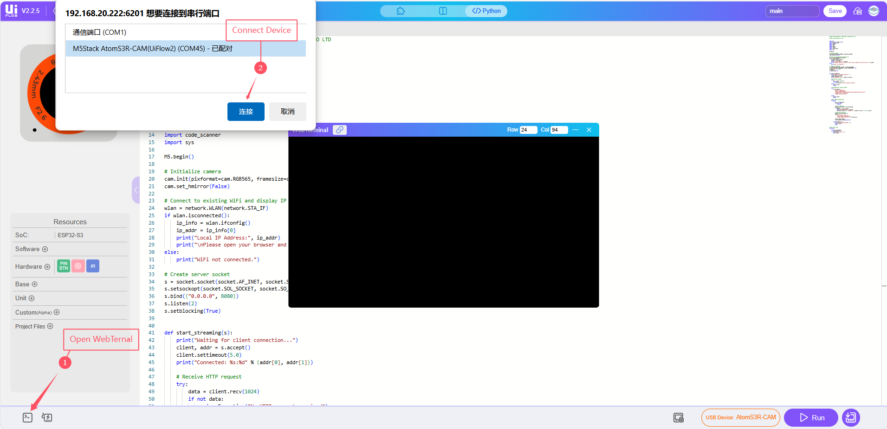
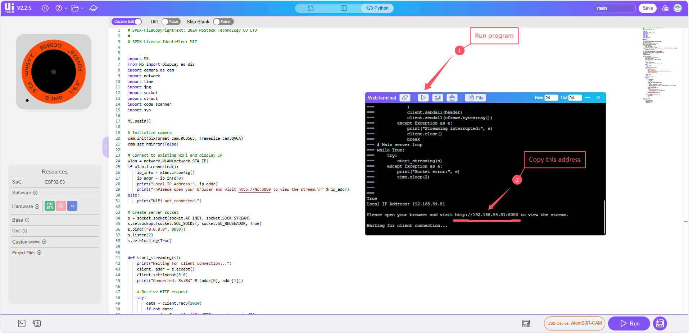
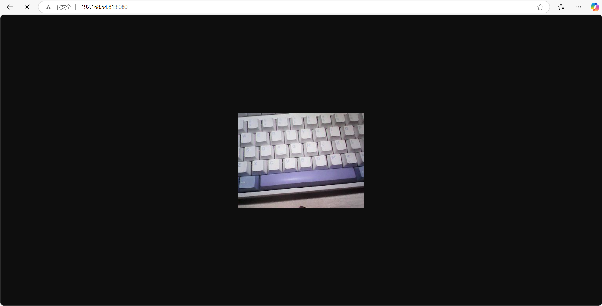

AtomS3R-CAM
==============

.. sku: C126-CAM

.. include:: ../refs/controllers.atoms3r_cam.ref

Support the following products:

    |AtomS3R-CAM|

MicroPython Example:
--------------------------

Video Streaming
^^^^^^^^^^^^^^^^^^^^^^^^^^^^

This example implements a real-time video streaming server, with integrated QR code recognition.

MicroPython Code Block:

    .. literalinclude:: ../../../examples/controllers/atoms3r_cam/video_streaming.py
        :language: python
        :linenos:

Example output:

    None

**How to Use**

1. Configure Wi-Fi settings.

1. Copy the example code into the editor.

3. Run the program, After uploading, the console will print the local IP address assigned to the device.

5. Open the video stream in your browser

On any device connected to the same Wi-Fi network, open a browser and visit: http://<device-ip>:8080/,
Replace `<device-ip>` with the actual IP address printed in the console.

